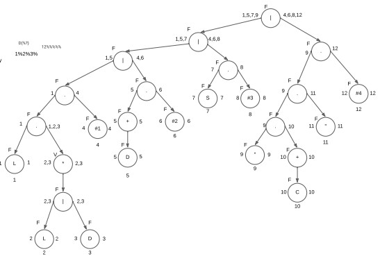
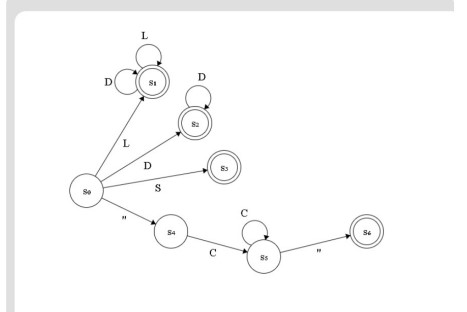
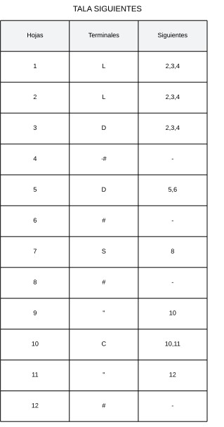

# Manual Técnico - Sistema de Análisis Léxico con Interfaz Gráfica (Python y Fortran)

## 1. Introducción

EL PROPÓSITO DEL CÓDIGO ES ANALIZAR UN CONTENIDO ESTRUCTURADO QUE REPRESENTA
CONTINENTES Y PAÍSES, Y GENERAR UN ARCHIVO DE SALIDA EN FORMATO GRAPHVIZ (DOT) PARA
REPRESENTAR VISUALMENTE LA SATURACIÓN DE CADA CONTINENTE Y PAÍS EN UN GRÁFICO. EL
GRÁFICO SE VISUALIZARÁ EN FUNCIÓN DE UN PORCENTAJE DE SATURACIÓN, REPRESENTANDO ASÍ
LA INFORMACIÓN DE FORMA CLARA Y CONCISA

---
**ALCANCES**

La finalidad de éste manual técnico es instruir
a la persona que quiera administrar, editar o
configurar el software usando las debidas
herramientas.

¿Claro, el objetivo principal del analizador
léxico es leer los caracteres de entrada de
un programa fuente y convertirlos en una
secuencia de componentes léxicos,
también conocidos como tokens1. Estos
tokens son utilizados posteriormente por
el analizador sintáctico para realizar el
análisis sintáctico del código1.
El analizador léxico también realiza algunas
funciones secundarias, como eliminar
comentarios y espacios en blanco, y
asociar mensajes de error con el programa
fuente1

---

## 2. Requisitos del Sistema

### 2.1 Hardware
- Computadora con procesador de 2 núcleos o más.
- Al menos 2 GB de RAM.

### 2.2 Software
- **Python 3.x**: Interfaz gráfica.
- **gfortran**: Compilador de Fortran.
- **Graphviz**: Para generar gráficos a partir de archivos DOT.

### 2.3 Bibliotecas Python
- `tkinter`: Crear la interfaz gráfica.
- `PIL`: Mostrar imágenes.

---

## 3. Instalación

### 3.1 Python
1. Descargar e instalar Python desde [python.org](https://www.python.org/downloads/).

### 3.2 gfortran
Instalar `gfortran` usando:

- **Linux (Debian/Ubuntu)**:
   ```bash
   sudo apt-get install gfortran
   ```

### 3.3 Graphviz
Instalar `Graphviz` usando:

- **Linux**:
   ```bash
   sudo apt-get install graphviz
   ```

### 3.4 Instalar bibliotecas Python
Ejecutar:
```bash
pip install pillow
```

---

## 4. Arquitectura del Sistema

### 4.1 Frontend (Python)
Interfaz gráfica para cargar archivos, ejecutar el análisis y mostrar resultados.

### 4.2 Backend (Fortran)
Analiza el archivo cargado y genera un archivo DOT para crear un gráfico del análisis.

---

## 5. Descripción del Código

### 5.1 Código Python (`main.py`)
- **Clase `MainWindow`**: Define la ventana principal y su funcionalidad.
- **Clase `PersonalDataWindow`**: Ventana secundaria para mostrar información del desarrollador.

#### 5.1.1 Fragmento del Código Python
```python
class MainWindow(tk.Tk):
    def __init__(self):
        # Inicialización de la ventana principal
        ...
```

### 5.2 Código Fortran (`lexer.f90`)
- Analiza el archivo de entrada y genera un archivo DOT.
- **Módulo `ErrorInfo`**: Registra tokens válidos y errores.

#### 5.2.1 Fragmento del Código Fortran
```fortran
module ErrorInfo
    implicit none
    type :: ErrorData
        ...
end module ErrorInfo
```

---

## 6. Proceso de Ejecución

1. Abrir un archivo de texto desde la interfaz.
2. Ejecutar el análisis léxico.
3. Mostrar los resultados gráficos en la ventana.

---

## 7. Mantenimiento

### 7.1 Modificaciones en Fortran
Agregar nuevos tokens o reglas en el módulo `ErrorInfo`.

### 7.2 Modificaciones en Python
Modificar la clase `MainWindow` para ampliar la funcionalidad de la interfaz.

---

## 8. Conclusión

El sistema permite realizar análisis léxicos simples con visualización gráfica. Es fácilmente ampliable y modificable en ambas capas: frontend y backend.
--
## FUNCIONAMIENTO CODGIO
- Variables Principales: graf: Variable que acumula la
representación en formato DOT del
gráfico.
saturacioncontinente: Almacena la
saturación total de un continente.
sumarpaises: Cuenta el número de países
dentro de un continente.
nombrecontinente, nombrepais: Variables
que almacenan los nombres actuales de
los continentes y países que se están
analizando.
tokens: Array que registra los tokens
generados durante el análisis del
contenido.

## Estructura de Control 
Se utiliza un bucle do while que itera a
través de cada carácter del contenido,
permitiendo el análisis caracter por
caracter.
A través de estructuras if y select
case, el código maneja diferentes tipos
de caracteres (por ejemplo, saltos de
línea, espacios, llaves, y otros
caracteres especiales) y determina la
acción apropiada
```fortran
do while (puntero <= len)
        char = contenido(puntero:puntero)
    if (ichar(char) == 10) then
     prin*,"obtener información"
    elseif (ichar(char) == 9) 
        prin*,"para obtener los caracteres especiales"
        ...
end module ErrorInfo
```

## Generación del Gráfico
Cuando se identifica un continente
('continente'), se calcula su saturación
en relación con el número de países y
se genera un nodo en el gráfico en
función de la saturación:
Colores: Dependiendo del valor de
saturación (suma), el color del nodo
cambia (blanco, azul, verde, amarillo,
naranja, rojo).
Cuando se identifica un país ('pais'), se
agrega a la representación del gráfico
de manera similar, con un color que
también se basa en su saturación.

```fortran
    if (suma <= 15) then
            graf = trim(graf) // new_line('a') //trim(nombrecontinente) 
            'border="0" cellborder="1" cellspacing="0"><tr><td bgcolor="white">' // &
            
        elseif (suma <= 30) then
            graf = trim(graf) // new_line('a') //trim(nombrecontinente) 
            
    subroutine generar_graphiz_analizador(graf)
    implicit none
    character(len=*), intent(in) :: graf  ! Recibe la estructura del gráfico como argumento
    integer :: ios
    character(len=400) :: comando
    open(unit=10, file="graph.dot", status="replace", iostat=ios)
    if (ios /= 0) then
        
        return  ! Termina si hay error
    end if

    write(10, '(A)') trim(graf)  ! Escribe la estructura contenida en graf
    close(10)  ! Cerramos el archivo

    comando = "dot -Tpng graph.dot -o graph.png"
    call system(comando)
```

## Manejo de Tokens y Errores

A medida que se procesa el contenido, se
generan tokens para representar
elementos como espacios, llaves, puntos y
otros. Se utilizan para el análisis posterior y
para validar la estructura del contenido.
El código incluye un manejo de errores
robusto que registra cualquier carácter no
permitido o situaciones inesperadas en el
proceso de análisis
```fortran
tokensaprobadoslexema(1)%LEXEMATODO = 'grafica'
    tokensaprobadoslexema(2)%LEXEMATODO = 'nombre'
    tokensaprobadoslexema(3)%LEXEMATODO = 'continente'
    tokensaprobadoslexema(4)%LEXEMATODO = 'pais'
    !agregamos mas tokens
    tokensaprobadoslexema(5)%LEXEMATODO = 'poblacion'
    tokensaprobadoslexema(6)%LEXEMATODO = 'saturacion'
    tokensaprobadoslexema(7)%LEXEMATODO = 'bandera'
    else if (ichar(char) == 125) then
            !llave de cierre
    else if (ichar(char) == 123) then
            !abrir llave
```

## Finalización del Gráfico 

Al final del análisis, se cierra la estructura del
gráfico y se imprime el resultado en la variable
graf, que puede ser escrita a un archivo DOT
para su posterior visualización en Graphviz.

```fortran
    if (puntero == len) then

        graf = trim(graf) // new_line('a')// "}"
            
            
    end if
```

##  Consideraciones Finales

Eficiencia: El código está diseñado para
ser eficiente en el análisis y generación de
gráficos, permitiendo la visualización de
estructuras complejas de manera sencilla.
Extensibilidad: Se pueden agregar nuevos
tipos de representaciones o reglas de
análisis simplemente ajustando las
condiciones en el bucle principal y las
funciones de generación de gráfico

## ARBOL


## FUNCIONAMIENTO Y AFD




## TABLAS 
