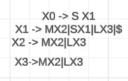

# Manual Técnico: Analizador Léxico y Sintáctico a HTML y CSS

## 1. Introducción

Este manual técnico tiene como objetivo guiar al usuario en la comprensión y 
utilización del analizador léxico y sintáctico desarrollado para la traducción de 
código a HTML y CSS. Se detallarán los componentes principales del sistema, su 
funcionamiento y las instrucciones necesarias para su uso.

---
## 1. Índice:

Introducción
1. 1 Contexto del proyecto
1. 2 Objetivos del analizador
Conceptos básicos
2. 1 Análisis léxico
2. 2 Análisis sintáctico
2. 3 HTML y CSS
Arquitectura del analizador
3. 1 Diagrama de flujo
3. 2 Módulos principales
Guía de usuario
4. 1 Instalación
4. 2 Configuración
4. 3 Uso básico
4. 4 Ejemplos
Desarrollo y pruebas
5. 1 Lenguajes y herramientas utilizadas
5. 2 Casos de prueba
Conclusiones y trabajo futuro


-----
**Objetivos:**


1. Explicar los conceptos básicos de análisis léxico y sintáctico.
2. Detallar la arquitectura del analizador y sus módulos.
3. Mostrar cómo utilizar el analizador para transformar código fuente en HTML y CSS.
4. Proporcionar ejemplos prácticos de uso.
5. Documentar posibles errores y soluciones.

---

## 2. Requisitos del Sistema

### 2.1 Hardware
- Computadora con procesador de 2 núcleos o más.
- Al menos 2 GB de RAM.

### 2.2 Software
- **Python 3.x**: Interfaz gráfica.
- **gfortran**: Compilador de Fortran.

---

## 3. Instalación

### 3.1 Python
1. Descargar e instalar Python desde [python.org](https://www.python.org/downloads/).

### 3.2 gfortran
Instalar `gfortran` usando:

- **Linux (Debian/Ubuntu)**:
   ```bash
   sudo apt-get install gfortran
   ```

- **Linux**:
   ```bash
   sudo apt-get install graphviz
   ```

### 3.3 Instalar bibliotecas Python
Ejecutar:
```bash
pip install pillow
```

---

## 4. Arquitectura del Sistema

### 4.1 Frontend (Python)
Interfaz gráfica para cargar archivos, ejecutar el análisis y mostrar resultados.

### 4.2 Backend (Fortran)
Analiza el archivo cargado y genera un archivo DOT para crear un gráfico del análisis.

---

## 5. Entendimiento General del Código

### 5.1 Código Analizador (`fortran.f90`)
- **Clase `analizador léxico`**: 
1. Lee el código fuente: Caracter por carácter, construyendo tokens.
2. Identifica tokens: Reconoce diferentes tipos de tokens como identificadores, números, símbolos, palabras reservadas, etc.
3. Maneja errores: Reporta errores léxicos al encontrar caracteres inválidos.
4. Construye un árbol de sintaxis: (Aunque no se muestra explícitamente en el fragmento proporcionado, se asume que la subrutina parser se encarga de esto).
5. Genera código HTML y CSS: Basándose en el árbol de sintaxis, crea archivos HTML y CSS para representar la interfaz diseñada.
- **Clase `Partes Clave del Código y Explicaciones`**: 
1. Estado de la máquina de estados: La variable estado controla en qué parte del token se encuentra el analizador.
2. Tabla de tokens: Aunque no se muestra explícitamente, se asume que hay una estructura de datos (posiblemente una tabla hash) para almacenar los tokens identificados junto con su tipo y ubicación.
3. Generación de HTML y CSS: Las subrutinas generar_html y generar_css utilizan la información almacenada en las estructuras de datos para construir los archivos HTML y CSS.
4. Jerarquía de elementos: La estructura jerarquia_array parece almacenar la relación padre-hijo entre los elementos de la interfaz, lo que permite generar el HTML con la estructura correcta.

#### 5.1.1 Fragmento del Código Fortran

```fortran
len = len_trim(contenido)

    do while(puntero <= len)
        char = contenido(puntero:puntero)
        select case (estado)
            case (0)
            .....
    end do 
```


### 5.2 Subrutinas en el código 
- Analiza el archivo de entrada y genera un archivo DOT.
- **Módulo `ErrorInfo`**: Registra tokens válidos y errores.
En el código que proporcionaste, se utilizan varias subrutinas para diferentes tareas:

- generar_css(): Esta subrutina genera el archivo CSS con las reglas de estilo para los elementos de la interfaz.
- generar_html(): Esta subrutina genera el archivo HTML con la estructura de la interfaz.
- escribir_css(): Esta subrutina escribe una regla CSS en el archivo CSS.
- escribir_contenedor(): Esta subrutina escribe un contenedor HTML en el archivo HTML.
- escribir_elemento(): Esta subrutina escribe un elemento HTML (etiqueta, botón, texto, clave) en el archivo HTML.

```fortran
    call generar_css()
```
#### 5.2.1 Beneficios de las subrutinas:
- Modularización: Dividen el código en partes más pequeñas y manejables.
- Reutilización: Se pueden reutilizar las subrutinas en diferentes partes del código.
- Legibilidad: Mejoran la legibilidad del código al separar las tareas en funciones específicas.
- Mantenibilidad: Facilitan el mantenimiento y la modificación del código.

```fortran
    subroutine generar_css()
    use etiqueta
    use contenedor
    use boton
    use texto
    use clave
    implicit none
    integer :: iunit
    character(len=255) :: control, posicion, color
    integer :: i

    ! Abrimos el archivo CSS para escritura
    open(unit=10, file='LFP_1.css', status='replace')

    do i = 1, size(etiqueta_array)
        control = "#"// trim(etiqueta_array(i)%id)
        posicion = "position: absolute; top: "// trim(etiqueta_array(i)%posicion_y) &
                   //"px; left: "// trim(etiqueta_array(i)%posicion_x) //"px; width: "// &
                   trim(etiqueta_array(i)%ancho) //"px; height: "// trim(etiqueta_array(i)%alto) //"px;"
        color = "color: rgb(" // trim(etiqueta_array(i)%color_texto_r) // "," &
               // trim(etiqueta_array(i)%color_texto_g) // "," // trim(etiqueta_array(i)%color_texto_b) // ");"
        call escribir_css(10, control, posicion, color)
    end do

    ! ... (código similar para otros elementos)

    ! Cerramos el archivo
    close(10)
contains
    subroutine escribir_css(iunit, control,posicion, color )
        ! ... (código para escribir una regla CSS)
    end subroutine escribir_css
end subroutine generar_css
```
---

## 6. Módulo token

1. Define una estructura de datos llamada Tkn para representar un token (una unidad léxica del lenguaje).
2. Incluye una subrutina agregar_token para agregar tokens a un arreglo.
3.Contiene subrutinas para imprimir los tokens en un archivo de texto y en un archivo HTML.
4.Incluye una subrutina parser que realiza el análisis sintáctico del código fuente y construye la estructura de la interfaz.

## Subrutina parser

- Analiza los tokens uno por uno y construye la estructura de la interfaz.
- Identifica diferentes tipos de elementos (etiquetas, contenedores, botones, etc.).
- Establece las propiedades de cada elemento (tamaño, posición, color, etc.).
- Construye la jerarquía de los elementos.

```fortran
    subroutine agregar_token(lexema, tipo, fila, columna)
    ...
end subroutine agregar_token
```
---

## 7. python

### 7.1 Ventana Principal
- Proporciona una interfaz intuitiva con dos áreas de texto: una para ingresar el código fuente y otra para mostrar los - - resultados del análisis.
- Un menú permite abrir, guardar y crear nuevos archivos, así como iniciar el análisis y visualizar los tokens.
- Un árbol (TreeView) muestra los tokens identificados en una tabla organizada.

### 7.2 Análisis Léxico:
- Al hacer clic en "Análisis", el código ejecuta un programa Fortran externo (analizador.exe).
- Este programa Fortran realiza el análisis léxico del código ingresado y genera un archivo tokens.txt con los resultados.
- El código Python lee el archivo tokens.txt y muestra los tokens en el Treeview.
---
### Aspectos Destacados:
1. Modularidad: El código está bien estructurado en funciones con responsabilidades claras.
2. Manejo de archivos: Permite abrir, guardar y crear nuevos archivos de código.
3. Interfaz gráfica: Proporciona una interfaz fácil de usar para el usuario.
4. Integración con Fortran: Utiliza subprocess para interactuar con el programa Fortran de forma efectiva.
5. Manejo de errores: Incluye comprobaciones para verificar la existencia de archivos y manejar posibles excepciones.
### Posibles Mejoras:
- Gestión de errores más robusta: Se podrían agregar más comprobaciones de errores, como verificar la sintaxis del código - Fortran antes de compilarlo.
- Personalización de la interfaz: Se podrían agregar más opciones de configuración, como elegir el tema de color o el - tamaño de la fuente.
- Integración de un editor de código: Se podría incorporar un editor de código con resaltado de sintaxis para mejorar la experiencia del usuario.
- Documentación: Agregar comentarios más detallados para explicar cada sección del código y facilitar su mantenimiento.

## 8. Conclusión

El sistema permite realizar análisis léxicos simples con visualización gráfica. Es fácilmente ampliable y modificable en ambas capas: frontend y backend.
--
## FUNCIONAMIENTO CODGIO
- Leer el código fuente: Recibe el código que el usuario ingresa en la interfaz gráfica y lo analiza carácter por carácter.
- Identificar tokens: Utiliza técnicas como autómatas finitos o expresiones regulares para reconocer patrones en el código y clasificarlos como tokens (palabras clave, identificadores, números, etc.).
- Construir una tabla de símbolos: Almacena información sobre cada token encontrado, como su tipo, valor y posición en el código.
- Generar un archivo de salida: Crea un archivo (por ejemplo, tokens.txt) donde se registra cada token identificado, junto con su información correspondiente.

## Estructura de Control 
-Se utiliza un bucle do while que itera a
través de cada carácter del contenido,
permitiendo el análisis caracter por
caracter.
A través de estructuras if y select
case, el código maneja diferentes tipos
de caracteres (por ejemplo, saltos de
línea, espacios, llaves, y otros
caracteres especiales) y determina la
acción apropiada
```fortran
do while (puntero <= len)
        char = contenido(puntero:puntero)
    if (ichar(char) == 10) then
     prin*,"obtener información"
    elseif (ichar(char) == 9) 
        prin*,"para obtener los caracteres especiales"
        ...
end module ErrorInfo
```


## Manejo de Tokens y Errores

A medida que se procesa el contenido, se
generan tokens para representar
elementos como espacios, llaves, puntos y
otros. Se utilizan para el análisis posterior y
para validar la estructura del contenido.
El código incluye un manejo de errores
robusto que registra cualquier carácter no
permitido o situaciones inesperadas en el
proceso de análisis
```fortran

    tokensaprobadoslexema(2)%LEXEMATODO = 'nombre'
    tokensaprobadoslexema(3)%LEXEMATODO = 'linea'
    tokensaprobadoslexema(4)%LEXEMATODO = 'columna'
    
    else if (ichar(char) == 125) then
            !llave de cierre
    else if (ichar(char) == 123) then
            !abrir llave
```


##  Tabla de tokens
- Para crear una tabla de tokens, necesitamos identificar
- los componentes léxicos del lenguaje utilizado. Basándonos en los patrones 
-  en el código, podemos definir los siguientes tokens y sus expresiones regulares correspondientes:

| Token | Expresión Regular | Descripción|
|---|---|---|
| Identificador | [a-zA-Z_][a-zA-Z0-9_]* | Nombres de variables, funciones, etc. (ej: contFondo, cmdIngresar)|
| Palabra reservada | (contenedor) | boton |
| Número entero | \d+ | Números enteros (ej: 270, 180) |
| Cadena de texto | "[^"]*" | Cadenas de caracteres encerradas entre comillas dobles (ej: "Ingresar")|
| Signo de puntuación | [.,;()=:] | Punto, coma, paréntesis, igual, dos puntos |
| Comentario | //.* | Comentarios de una línea que comienzan con // |


Eficiencia: El código está diseñado para
ser eficiente en el análisis y generación de
gráficos, permitiendo la visualización de
estructuras complejas de manera sencilla.
Extensibilidad: Se pueden agregar nuevos
tipos de representaciones o reglas de
análisis simplemente ajustando las
condiciones en el bucle principal y las
funciones de generación de gráfico

## ARBOL


## FUNCIONAMIENTO Y AFD




## TABLAS 

