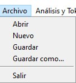
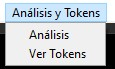
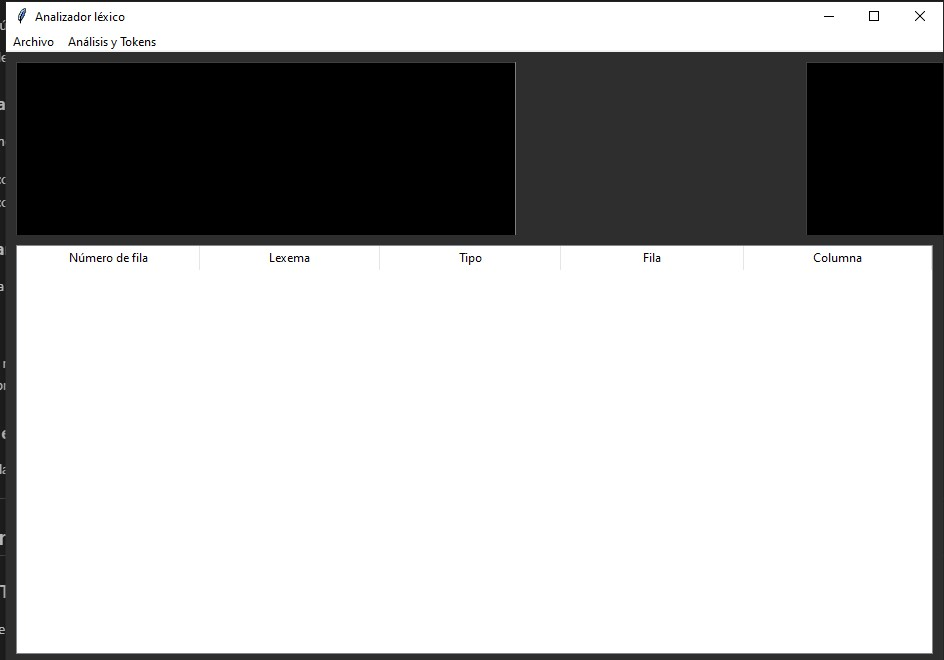

# Manual de Usuario: 

Este manual te guiará a través del uso de la aplicación Analizador Léxico Gráfico, una herramienta diseñada para analizar código y generar tokens. El analizador se basa en un programa escrito en Fortran que procesa el código ingresado y lo divide en unidades lexicográficas (tokens).
## Requisitos del Sistema

Antes de comenzar, asegúrate de que tu entorno cumple con los siguientes requisitos:

- **Python 3.6 o superior**: Instala Python desde [python.org](https://www.python.org/).
- **Tkinter**: Viene incluido con la mayoría de las instalaciones de Python, pero si es necesario, puedes instalarlo utilizando tu gestor de paquetes del sistema.
- **Pillow**: Biblioteca para manipulación de imágenes. Instálala usando `pip`:
  ```bash
  pip install Pillow
  ```
- **GNU Fortran (gfortran)**: Necesario para compilar el código Fortran. Puedes instalarlo desde el gestor de paquetes de tu sistema (por ejemplo, `apt install gfortran` en distribuciones basadas en Linux).

## Instrucciones de Uso

### 1. Interfaz Gráfica
La aplicación cuenta con una interfaz gráfica intuitiva dividida en las siguientes secciones:
#### Menu principal

1. Archivo:
2. Abrir: Permite abrir un archivo de texto que contenga el código a analizar.
3. Nuevo: Crea un nuevo archivo de texto en blanco.
4. Guardar: Guarda el código ingresado en el archivo actualmente abierto.
5. Guardar como...: Permite guardar el código en un archivo nuevo con el nombre y ubicación que especifiques.
6. Salir: Cierra la aplicación.
#### Análisis y Tokens:
- Análisis: Envía el código ingresado al analizador Fortran para su procesamiento.
- Ver Tokens: Muestra en una tabla los tokens generados por el análisis.




### 2. Área de edición izquierda:

Aquí puedes ingresar o pegar el código que deseas analizar.


#### 2.1 Botón "Análisis":

Presiona este botón para iniciar el análisis del código ingresado.



#### 2.2 Área de resultados derecha
En esta sección se mostrará el resultado del análisis. Si el análisis se realiza con éxito, se mostrarán los tokens generados. En caso de errores, se mostrará un mensaje indicando el problema.


**Pasos**:
1. Selecciona `Abrir` en el menú principal.
2. Navega hasta el archivo que desees analizar (formato `.org` o `.txt` recomendado).
3. El contenido del archivo aparecerá en el cuadro de texto.

#### 2.3 Botón de Análisis

A la derecha del área de texto, encontrarás un botón etiquetado como **Análisis**. Este botón ejecuta el proceso de análisis léxico.


**Pasos**:
1. Asegúrate de que el archivo de entrada esté cargado o el texto esté escrito en el área de texto izquierda.
2. Haz clic en el botón **Análisis**. Esto ejecutará el código Fortran que procesará el contenido del archivo o texto.


#### 2.4 Visualización de la Imagen

Una vez que el análisis léxico se complete, la imagen generada aparecerá en el área derecha de la ventana.

**Pasos**:
1. Asegúrate de haber presionado el botón **Análisis**.


### 3. Guardar Cambios

Si realizas modificaciones en el contenido de entrada y deseas guardar esos cambios:

- Selecciona `Guardar` para sobreescribir el archivo actual.
- Selecciona `Guardar Como` para guardar el contenido en un nuevo archivo con un nombre diferente.

### 4. Mostrar Datos Personales

El programa incluye una opción para mostrar los datos del desarrollador.

**Pasos**:
1. En el menú principal, selecciona la opción `Acerca de`.
2. Se abrirá una nueva ventana que mostrará los datos personales como nombre, carnet y otros datos relevantes.

### 5. Cerrar el Programa

Para cerrar la aplicación, selecciona la opción `Salir` en el menú principal o simplemente cierra la ventana principal.

---

## Solución de Problemas


### Tabla de Tokens

Esta tabla se mostrará al presionar el botón "Ver Tokens". La tabla contiene las siguientes columnas:

- Número de fila: Indica el número de línea en la que se encontró el token.
- Lexema: Representa la secuencia de caracteres del token.
- Tipo: Indica el tipo de token identificado (por ejemplo, palabra clave, identificador, operador).
- Fila: Indica la fila en la que se encontró el token en el código original.
- Columna: Indica la columna en la que se encontró el token en el código original.-


## Conclusión

Este programa combina Python y Fortran para realizar un análisis léxico a través de una interfaz gráfica amigable. Sigue los pasos descritos en este manual para cargar archivos, ejecutar el análisis y guardar los resultados de manera eficiente.